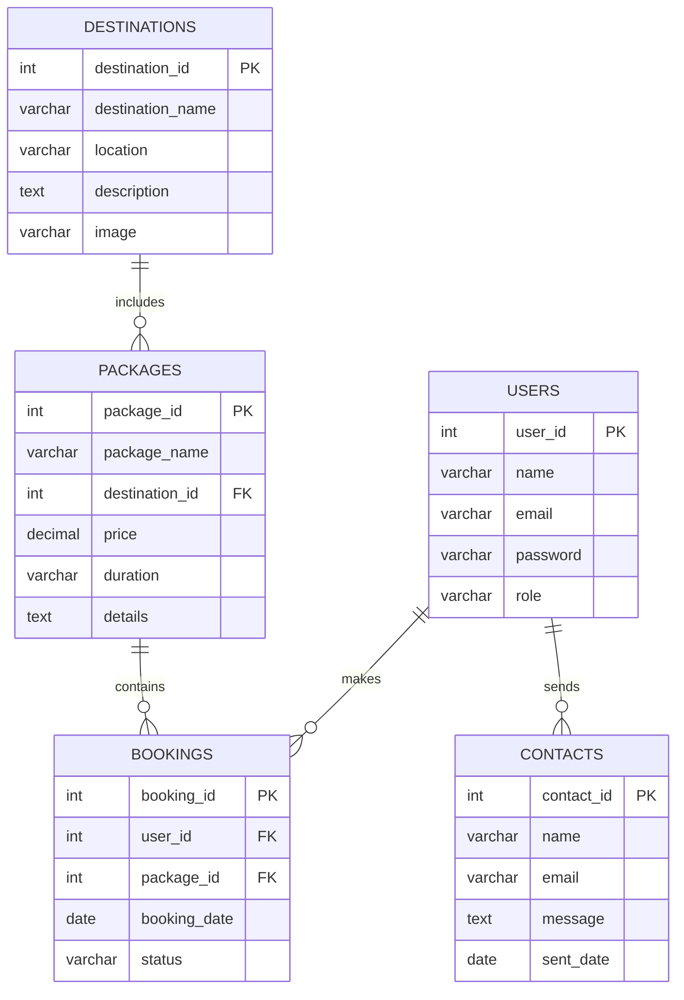

# Travel-Management-System
php mysql based travel management system with bootstrap

# 🌍 Travel & Tourism Website

A full-stack **Travel & Tourism Management System** designed to help users explore destinations, book trips, and manage travel plans seamlessly.  
Built using modern **web technologies** for a professional and responsive experience.

---

## 🚀 Project Overview

**Objective:**  
To build a dynamic travel website that allows users to browse destinations, book tours, and view packages with real-time updates using a connected backend (PHP + MySQL).

**Features:**
- User registration & login (with validation)
- Explore tourist destinations with photos & details
- Package booking system
- Admin dashboard for managing destinations, users & bookings
- Responsive design (mobile & desktop friendly)
- Search, filter & contact forms
- Integrated database (MySQL) for backend management
- **Live Localhost Link:**  
👉 [http://localhost/travel/](http://localhost/travel/)

---

## 🛠️ Languages & Tools Used

| Category | Tools / Technologies |
|-----------|----------------------|
| **Frontend** | HTML5, CSS3, JavaScript |
| **Backend** | PHP (XAMPP environment) |
| **Database** | MySQL |
| **Version Control** | Git & GitHub |
| **Deployment** | Localhost (XAMPP) / 000WebHost / Replit (for online testing) |
| **Editor** | VS Code |
| **Design** | W3Layouts Template, Custom Styling |

---

## ⚙️ Setup Instructions

1. **Install XAMPP / WAMP** on your system.
2. Place the project folder in `htdocs` (for XAMPP) or `www` (for WAMP).
3. Start **Apache** and **MySQL** from the XAMPP Control Panel.
4. Open [phpMyAdmin](http://localhost/phpmyadmin).
5. Create a new database named `travel_db`.
6. Import the file `sql/travel_db.sql`.
7. Open your browser and visit:

---

---

## 🧩 ER Diagram

The following **Entity Relationship Diagram (ERD)** represents the database structure of the Travel & Tourism Management System:

---

## 🧑‍💻 Author

**V.B. Sudarsini**  
Student - Artificial Intelligence & Data Science  
Capstone Project: *Travel & Tourism Website*  

